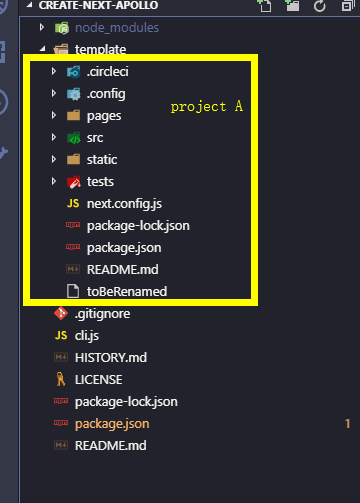

# Create NPM Create

Quick Start:

```
npm i -g create-npm-create
create-npm-create create-example-app

or

npx create-npm-create create-example-app
```

Welcome to packageception 😈

to put it simple: this is a package that allow you to create something like create-react-app, but much simpler and easier to use.

For example if you have project A and you want to create a project generator for project A

It is very easy to use, after installation, just follow this step:

1. rename project A .gitignore to toBeRenamed
2. copy everything in project A (except node_modules and ect) into the template folder

you can study this example [Create Prisma App](https://github.com/tylim88/create-prisma-app) and [Create Next Apollo](https://github.com/tylim88/create-next-apollo)

it will finally look like this


after you are done with your package name and description, simply npm publish.

What it does:  
-copy everything in template directory when your user run create-example-app <project-name>  
-automatically install the dependency for your user.
